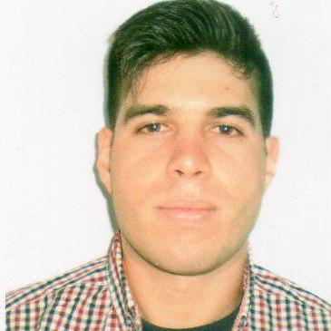
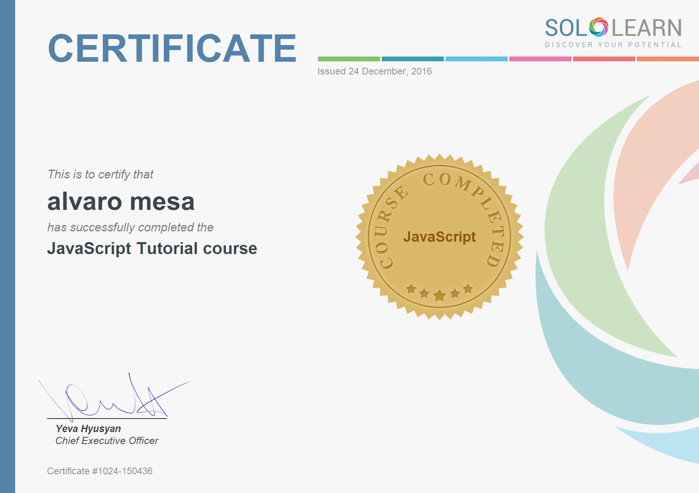

<h1>  Mi Curriculum </h1>

<h2> Alvaro Mesa Técnico en Soporte Informático</h2>

Cedula de Identidad: 4246412-5  
Teléfono: -26014380 -098369509 
tsi.iamesa@gmail.com 
<a href ="http://alvaromesa.com">Presencia Online</a>

<h2> Resumen </h2>

Un Técnico en Soporte Informático que se adapta a resolver problemas complejos de red y de la administración de Directorios Activos, constantemente actualizando sus conocimientos, capacitándose para cumplir con tareas de Programación Web y Desarrollo. Mantiene la calma en situaciones de estrés con una mente calma y positiva.

<h2>Capacidades</h2>
<ul>
<li>Competente en Resolución de problemas de Infraestructura de red.</li>
<li>Paciente y Diligente.</li>
<li>Experiencia con tecnologías de Redes LAN y WAN.</li>
<li>Experiencia en Mantenimiento de Ordenadores e Instalación de Software/Hardware.</li>
<li>Organizado y Orientado a servir.</li>
<li>Capacitado para administrar Servidores, Directorios Activos y Políticas de Grupo.</li>
<li>Conocimientos en Diseño de Responsive Webs y Webs dinámicas.</li>
<li>Conocimiento de Programación de Paginas Webs y bases de datos.</li>
<li>Constantemente incorporando nuevas tecnologías.</li>
<li>Posee licencia de Conducir cat A y propios medios de transporte.</li>
<li>Maneja el Idioma Español nativo e Inglés Intermedio.</li>
<li>Posee sus propias herramientas de trabajo.</li>
</ul>

<h2> Experiencia </h2>

<b>Soporte Técnico en Colegio San Pablo Montevideo</b>  03/2015 al momento. 
Trabajo como Técnico Soporte Informático, cumplo con la atención y soporte a usuarios internos, resolución de incidentes, administración de redes, puesta en marcha de equipos, contacto con proveedores de servicios, cambio de hardware, inventariado de equipo, gestion de tickets,etc.

<b>Reparación de Ordenadores, en Emprendimiento Personal</b> 04/2015 al momento.  
Realizando trabajos particulares, instalación y mantenimiento de software, reparación y recambio de hardware para computadoras de escritorios.

<b>Operador de Línea de emergencia, Ministerio del Interior</b>  10/2011 al momento. 
Recepcionando telefónicamente llamadas de emergencia, digitando eventos en situaciones estresantes en las cuales mantengo excelentes tiempos de digitación y recepción de llamadas.

<b>Digitador, en Securitas temporal</b> del 11/2010 al 01/2011. 
Digitando Planillas Excell, documentos en Word, supervisando listados de las guardias y personal en los puestos.

<h2> Estudios</h2>

<b>2017

Analista Programador, en la Facultad de Ingeniería ORT.</b> 
Desarrollar soluciones de software con capacidad de adaptación a la constante evolución de la tecnología y con un perfil basado en la aplicación práctica e innovadora de conocimientos.

<b>Programador PHP y MySQL, en Instituto BIOS.</b> 
Poseer los conocimientos necesarios para comprender y crear páginas Web dinámicas, utilizando HTML/XHTML, CSS, JS, y PHP conjuntamente con MySQL como gestor de bases de datos.

<b>Front End Developer in Free Code Camp.</b> 
Estudiando de manera autodidacta programación web, colaborando con distintas organizaciones no gubernamentales sin fines de lucro realizando proyectos y  trabajando remotamente con otros programadores alrededor del mundo.

<h2> Títulos</h2>

<b>2015-2016.

Técnico en Soporte Informático, en la Facultad de Ingeniería ORT.</b> 
Dar soporte a usuarios sobre redes LAN y WAN, diagnosticar y reparar equipos informáticos, como también administrar redes sobre plataforma Microsoft Server.

<b>2015.

Técnico en Instalación y Mantenimiento de Redes, en ORT.</b> 
Capacitado en el área de networking, con sólidos conocimientos teóricos y fuerte experiencia práctica, en las tecnologías predominantes en el mercado.

<b>2014.
Técnico en Reparación PC e Instalación de Redes, en Instituto BIOS.</b> 
Instalar y mantener Ordenadores, recambio de hardware del equipo o del cableado de redes.

<b>2010.
Diseño Web y Diseño Gráfico, en Circulo Informático.</b> 
Capacitado en el Diseño de Páginas Webs estáticas mediante herramientas como Adope Photoshp, Corel y Dreamweaver.
2008.

<b>6to Bachiller formación en Derecho, en Liceo Militar “General Artigas”.</b>

<h2>Otros Estudios </h2>

<b>Code Academy y Code School</b> 
Realizando cursos practicos de programación con  distintas tecnologias actuales, HTML, CSS, Javascript, jQuery, PHP, SQL, GIT, etc.

<b>Advanced English in Alianza</b> 
Currently doing an Advanced course in Alianza Montevideo.

<h2>Tecnologias que manejo </h2>

